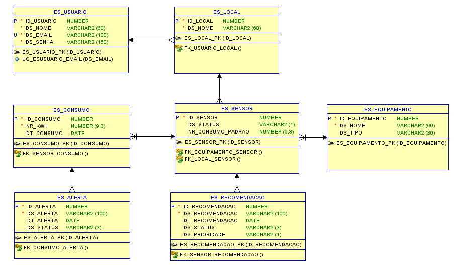

# EcoSynergy

## Sistema de Monitoramento de Eficiência Energética e Painéis Solares  

O EcoSynergy é um sistema avançado de monitoramento de eficiência energética voltado para ambientes residenciais, comerciais e para o acompanhamento de painéis solares. Ele integra sensores IoT para coleta de dados em tempo real, utiliza inteligência artificial (IA) para análise e personalização de relatórios e fornece uma interface web e mobile para visualização dinâmica e personalizada de dados de consumo e eficiência energética.  

A plataforma é capaz de monitorar padrões de consumo, identificar picos de uso, detectar equipamentos em stand-by e oferecer recomendações para promover maior eficiência e economia de energia. Além disso, o sistema permite aos usuários ajustar automaticamente padrões de consumo com base nos dados coletados e no feedback contínuo, contribuindo para a sustentabilidade.  

No contexto de monitoramento de painéis solares, a IA do EcoSynergy foi ajustada para exibir relatórios simples e personalizáveis, permitindo que cada cliente escolha como visualizar suas informações. Esses relatórios serão integrados ao front-end, oferecendo uma experiência mais dinâmica e acessível para consulta de dados de consumo e eficiência.  

A arquitetura do sistema inclui sensores IoT para captura de dados, um gateway para processamento inicial, uma API backend responsável por cálculos e gerenciamento, além de bancos de dados relacional e NoSQL para armazenamento estruturado e histórico. 

O EcoSynergy se destaca por sua robustez, escalabilidade e capacidade de adaptação a diferentes perfis de usuários, tornando-se uma ferramenta essencial para economia de energia, sustentabilidade e monitoramento eficiente de sistemas solares e elétricos.

## Integrantes:
- **Lucas Petroni** - RM97861
- **Matheus Paulo Lima Delgado** - RM552189
- **Caio Boris** - RM552496
- **Nathaly Oliveira** - RM552538
- **Denner Duarte** - RM551938

## Instruções para rodar a aplicação:
Ao clonar a aplicação e importá-la na IDE de preferência, rodar a classe `EcoSynergyApplication`. O servidor acoplado à aplicação iniciará, ficando disponível para uso na URL `http://localhost:8080`.

## Links
- **Link do pitch no YouTube**: [Clique aqui](https://www.youtube.com/watch?v=pR0H1GuXL6Q)
- **Link da aplicação**: [Clique aqui](https://movtoagroplus-rm552189.azurewebsites.net/)
- **Link da apresentação técnica**: [Clique aqui](https://drive.google.com/file/d/1tIzVavyJDZvb4PIGuE8H-z6XuM4S2qa1/view?usp=sharing)

## Diagramas

### Diagrama de Entidades e Relacionamentos

